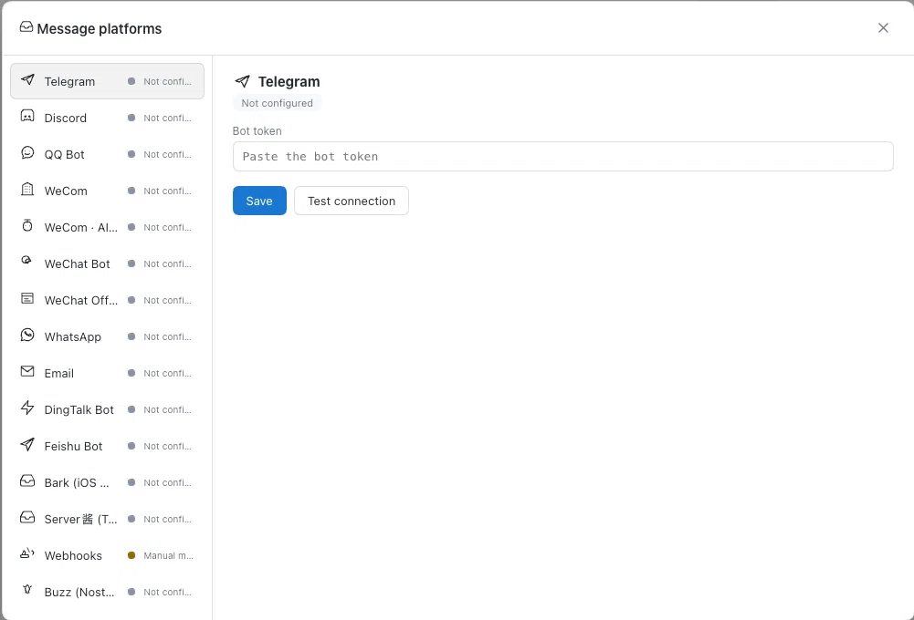

# @tech-voyage-dev/dsh-message-gateway

[English](README.md) · [Español](README.es.md)

> **分支说明** — 本仓库是 [a792883583/dsh-message-gateway](https://github.com/a792883583/dsh-message-gateway) 的派生版本（由 [Tech-Voyage-Dev](https://github.com/Tech-Voyage-Dev) 维护），新增 **Buzz（Nostr）桥接**与海外平台智能代理支持。安装派生版本：`dsh plugin --profile web add @tech-voyage-dev/dsh-message-gateway`。



DSH Web GUI 的消息平台网关插件：在侧边栏「工作区」行、紧贴搜索图标左侧提供「消息平台」入口，全屏管理多平台消息连接器——凭据保存、连接测试、状态监控，并内置企业微信智能机器人的常驻桥接：外部消息经专用 agent 会话驱动 DSH 助手，回复按 token 流式回发；同时提供全平台通用主动图文推送通道（支持发送 Markdown 文本与多模态原生图片）。

## 功能

- **侧边栏入口**：侧边栏「工作区」行、**紧贴搜索图标左侧**新增「📮 消息平台」图标按钮（与官方搜索 / 视图 / 添加图标排成一行），点击打开全屏管理页（ESC / 点击遮罩关闭）
- **多平台连接器**：Telegram / Discord / QQ 机器人 / 企业微信 / 企业微信智能机器人 / 微信（外部 Wechaty 网关）/ 微信公众号 / WhatsApp / Email / 钉钉 / 飞书 / Bark / Server酱 / Webhooks / Buzz（Nostr 工作区）
  - **平台启用开关**：每个已配置平台一个「启用 / 停用」开关——停用即停止常驻桥、跳过自动启动、回调与主动推送全部拒绝，凭据保留，随时一键恢复（`POST /gateway/enable`）
  - **企业微信智能机器人**：填 `botId + secret` 保存即建立官方 SDK WebSocket 常驻连接；支持文本流式对话、素材上传与**主动图片/文件推送**
  - **Telegram 机器人**：填 Bot Token 保存即启用长轮询，与机器人对话即可使用，支持 `sendPhoto` **主动图片推送**
  - **Discord 机器人**：填 Bot Token 保存即接入网关，频道/私信直接对话，支持 `files` 附件**主动图片推送**
  - **钉钉群机器人**：配置自定义机器人 Webhook 与可选加签密钥（Secret），支持 Markdown 消息推送与公网图片 URL 渲染
  - **飞书群机器人**：配置自定义机器人 Webhook 与可选签名密钥（Secret），支持标准文本与卡片推送
  - **Bark (iOS)**：填入 Device Key，实现手机秒级弹窗通知推送与富文本大图横幅（公网 URL）
  - **Server酱 (Turbo版)**：填入 SendKey，支持将通知推送至微信 / 手机服务号，支持 Markdown 图片 URL
  - **QQ 机器人**：填 appId + secret 保存即连接开放平台网关（频道/群/私信），被动回复 + 流式编辑
  - **企业微信应用**：填 CorpID/AgentID/Secret + 回调 Token/EncodingAESKey，后台配置回调 URL（`/gateway/wecom/callback`）后发消息即自动对话
  - **微信公众号**：填 AppID/Secret + 回调 Token，后台配置服务器 URL（`/gateway/wechat-mp/callback`）后发消息即自动对话
  - **WhatsApp**：填 Token + Phone Number ID，Meta 后台配置 Webhook（`/gateway/whatsapp/webhook`）后发消息即自动对话
  - **Email**：填 IMAP（收件，993/143）+ SMTP（回复，465/587/25），按邮件线程自动归类会话，回复用 Re: 原主题
  - **Buzz (Nostr 工作区)**：填 Agent 私钥（`nsec1…` / 64 位 hex，可一键生成密钥对）+ Relay 地址保存即建立 NIP-42 认证 WebSocket 常驻连接；成员在频道中 **@提及** 机器人即可对话（DM 与机器人自己线程中的回复也会响应），回复以 kind-9 占位 + kind-40003 就地编辑实现流式打字效果；入站附件按 NIP-92 `imeta` 下载并校验 SHA-256
- **通用主动推送通道**：`POST /gateway/push`（供定时任务、自动化脚本、外部流水线等调用）：
  - 请求参数：
    - `platform`：目标平台（`wecom-aibot` / `telegram` / `discord` / `dingtalk` / `feishu` / `bark` / `serverchan` / `email` / `buzz`）
    - `target`：目标会话（`wecom-aibot` 为单聊 userid 或群 ID；`telegram` 为 chatId 数字；`discord` 为 channelId；`bark` 为 deviceKey；`buzz` 为频道 UUID 等）
    - `content`：可选文本内容（支持 Markdown）
    - `title`：可选标题（Email 作为主题，其他平台作为前缀）
    - `image`：可选图片数据（支持 **Base64** 编码数据，或公网可访问的 `http(s)://` 图片 URL）
    - `filename`：可选图片文件名（默认 `image.png`）
  - 特性：
    - 文字与图片可同时发送，亦可单独发送纯文字或纯图片
    - `wecom-aibot`、`telegram`、`discord` 支持本地二进制图片直接上传与原生下发
    - `bark`、`dingtalk`、`serverchan` 自动适配公网图片 URL 模式
- **凭据管理**：明文只落盘 `~/.dsh/gateway.json`（权限 600，原子写入），`/gateway/list` 永不回传凭据明文，只返回 configured 标记
- **敏感信息脱敏**：写入日志 / 控制台的消息内容自动遮蔽疑似密钥（`sk-` 前缀、GitHub token、`Bearer`、`password=` 赋值、私钥 PEM 等通用模式），机器人对话里的机密不会泄露到日志文件
- **连接测试**：每个平台独立的真实连接测试——Telegram/Discord 走 Bot API、QQ 走 access_token、企微走 gettoken、微信公众号走 cgi-bin/token、WhatsApp 走 Graph API、Email 走 IMAP TCP banner、企微智能机器人走官方 SDK 长连接（认证成功即通过）
- **企业微信智能机器人常驻桥**：官方 SDK WebSocket 长连接，断线自动指数退避重连；收到文本消息 → 注入隔离的专用 agent 会话唤醒 DSH 驱动 → 回复按 chunk 流式回发，结束时经 response_url 定稿
  - **多步骤流式聚合与防覆盖**：在多步骤/复杂工具调用任务中，自动按步骤段落累加保留历史思考与分析过程，绝不冲刷覆盖前文；中间步骤停顿时智能呈现三语动态处理提示（`⏳ 正在处理中，请稍候…`），定稿收官时自动无痕剥离
  - **全平台优雅关机与秒速重连**：系统级监听退出信号并主动向远端服务发送断开握手，杜绝 30 秒连接排队超时锁，服务重启后 1~2 秒内秒速上线
  - **群聊 @提及剥离**：去掉开头的 @机器人名后交给助手
  - **斜杠命令**：`/help` / `/time` / `/status`（含中文别名：帮助/菜单/时间/状态）
  - **进入会话欢迎语**：可选配置（配置项 `welcomeReply`，默认 `false` 保持免打扰，开启后用户当天首次进入单聊自动回复欢迎词）
  - **主动发送通道**：`POST /gateway/send`（`{"chatid": "...", "content": "..."}`，单聊=userid，群聊=群 ID）以机器人身份主动发送 markdown 消息
  - **消息路由规则**（插件配置 `routes`）：按「平台 + 关键词前缀」把消息路由到指定 **agent 预设**（独立会话）与可选**专用模型 / skill**。例如配置 `{ id: "code", matchPlatform: "telegram", matchPrefix: "code ", agentPreset: "code" }` 后，Telegram 里发 `code 帮我写个函数` 会进入 code 预设的独立会话。按顺序匹配第一条命中；未命中走默认 agent
  - **斜杠命令**：`/help` / `/time` / `/status` / `/stats` / `/workspace <目录>` / `/commands` / `/files` / `/model` / `/effort`（含中文别名：帮助/菜单/时间/状态/统计 / `工作区 <目录>` / `文件 <前缀>`）；`/stats` 展示各平台桥连接状态与活跃会话数
  - **Web 功能进聊天**：把 Web 输入框的能力直接搬进聊天——
    - **指令**：`/commands` 列出全部指令；任意 `/<指令名> …` 走**与 Web 的 / 面板完全相同的指令注册表**（`ctx.commands.execute`，如 /plan、/goal）——指令输出成为本轮提示词，出错则把错误文本回给聊天
    - **@文件引用**：`@路径/文件` 与 Web 的 @ 提及一致（模型相对聊天工作区读取文件）；单独发送 `@`、`@前缀` 或 `/files <前缀>` 会用与 Web 补全**同一个数据源**（`fileReferences`）回复匹配的文件/文件夹列表
    - **模型与思考力度**：`/model [provider model effort]` 为本聊天切换模型与思考力度——按实时 LLM 目录校验，下一条消息生效，与 Web 选择器同语义；单独 `/model` 列出可选模型（不带 effort 选择模型时确认回复附带该模型的可选力度），`/effort` 列出当前模型的思考力度，`/effort <id>` 调整力度，`/model reset` / `/effort reset` 恢复默认
  - **工作区切换**（配置 `allowWorkspace`，默认 `false`）：聊天指令 `/workspace <目录>` 把已有文件夹注册为 DSH 工作区——与 GUI「添加工作区」同源，侧边栏「工作区」行立即可见——并把本聊天会话的工作目录切换到该目录（上下文重置，下一条消息生效）；网关会话同时挂载到该工作区下，在 GUI 中随工作区分组显示
  - **Web UI 会话可见**：网关创建的每个聊天会话都会出现在 Web GUI 的会话列表（侧边栏工作区树，随其文件夹分组），且与 Web 会话**同款自动命名**（首条消息即时回退标题 + LLM 标题）——机器人对话可直接在 GUI 中点开查看
  - **Agent 主动推送工具**（`send_chat_message`）：自动向 DSH 注册通用推送工具，AI 助手在对话中可自主调用该工具将总结、任务结果或告警（含文字与图片截图）推送至企业微信、Telegram、Discord、钉钉等平台
- **Webhook 接收端点**：`POST /gateway/webhook/in` 接收外部系统消息（`text` / `content` / `message` 任一字段），注入专用 agent 会话并同步返回完整回复；可配置 HMAC-SHA256 签名密钥校验（契约见 [docs/webhooks.md](docs/webhooks.md)）
- **图片与文件附件接收（全平台）**：各平台按官方文档解析并下载用户发来的附件，交给 Agent 处理
  - **图片** → 存入附件库并以**多模态**交给模型（可直接识别画面内容）
  - **其它文件**（PDF / Excel / Word / 压缩包等任意类型）→ 以「文件名 + 字节数 + **只读路径**」句柄交给 Agent，Agent 用文件工具读取处理
  - 已接入：企业微信智能机器人（`image` / `file` / `video` / `mixed` 图文混排）、飞书（`image` / `file` / `audio` / `media` / 富文本 `post`）、钉钉（`picture` / `richText` / `audio` / `video` / `file`）、Telegram（`photo` / `document` / `animation` / `video` / `voice` / `audio` / `video_note` / `sticker`，含 `caption` 说明文字）、Discord（`attachments[]`）、QQ 机器人（`attachments[]`，含引用消息递归与语音 `asr_refer_text`）、微信 ilink（`item_list` 图片 / 语音 / 文件 / 视频，含 CDN AES 解密）、Email（标准 MIME 附件，支持 RFC 2231 中文文件名与 base64 / quoted-printable 解码）
  - **绝不静默丢弃**：任何未识别的消息类型都会收到一条用户可见的提示（如「收到该类型消息，暂不支持处理」），不会出现"发了消息却毫无响应"的情况
  - 各平台存在**官方侧限制**，见下方「[各平台官方限制](#各平台官方限制非本插件缺陷)」
- **微信个人号（可选外部网关）**：对接本机 Wechaty HTTP 网关的扫码登录与状态轮询（契约见 [docs/wechaty-gateway.md](docs/wechaty-gateway.md)）
- **多语言**：管理页界面自动跟随 DSH Web 界面语言（中文 / English / Español）；**机器人回复语言**跟随 `botLocale` 配置（默认 English）
- 明暗主题跟随 DSH Web GUI

## 使用

1. 打开 DSH Web（`dsh web`），点击侧边栏「消息平台」按钮
2. 左侧选择平台，右侧填写凭据
3. 点击「保存」：凭据落盘并立即自动触发一次连接测试，状态即时刷新
4. 点击「测试连接」：用当前表单值只测不存
5. 企微智能机器人保存 `botId + secret` 后立即建立常驻连接；删除配置即断开
6. 在任意已连接平台的聊天里发送 `/help` 查看全部聊天指令——Web 指令（`/commands`、`/<指令名>`）、`@文件` 浏览、模型与思考力度切换（`/model`、`/effort`）、工作区切换（`/workspace`）

## 安装

```sh
# 从 npm 安装（通用插件，任何 DSH 用户可直接使用）
dsh plugin --profile web add @tech-voyage-dev/dsh-message-gateway
```

重启 `dsh web`，侧边栏「工作区」那一行、**搜索图标左侧**即出现「📮 消息平台」图标按钮。打开页面，选择平台、
填入凭据并「保存」——企业微信智能机器人填 `botId + secret` 后立即建立常驻连接，即可
直接在企微里和机器人对话（与 Web 对话一致：每聊天独立会话 + 上下文自动压缩）。

## 配置

插件可通过 **Web GUI（设置 → 插件 → dsh-message-gateway）** 或 profile 的 `cordis.patch.yml` 补丁层调整（如 `- id: ui-message-gateway` + `config: { allowWorkspace: true }`；所有项均有默认值，开箱即用）：

| 配置 | 类型 | 默认 | 说明 |
| --- | --- | --- | --- |
| `botLocale` | `zh` \| `en` | `en` | 机器人回复文案语言（默认 English） |
| `maxChatAgents` | number | `40` | 每机器人最多保留的聊天会话数，超出自动淘汰最旧 |
| `botModel` | `{provider, model}` | 无 | 可选：机器人专用模型（优先于部署默认模型；不填则与 Web 对话一致） |
| `autoStartWecom` | boolean | `true` | 启动时自动用已保存的企业微信智能机器人凭据连接 |
| `groupReply` | boolean | `true` | 是否回复群聊消息（false 时只处理单聊） |
| `allowWorkspace` | boolean | `false` | 允许聊天指令 `/workspace <目录>`（或 `工作区 <目录>`）把目录注册为工作区并切换当前聊天的工作目录 |
| `welcomeReply` | boolean | `false` | 用户当天首次进入单聊时自动发送欢迎语 |
| `routes` | array | `[]` | 消息路由规则：平台 + 关键词前缀 → 指定 agent 预设 / 专用模型 / skill |
| `outboundWebhooks` | array | `[]` | 外部事件 Webhook 广播订阅列表（url、secret、events） |

## 各平台官方限制（非本插件缺陷）

下列限制**全部来自各平台官方接口的能力边界**（每条都可在官方文档中查证），不是本插件的 bug。
遇到这些行为时，请对照本表判断——它们**无法通过改插件绕过**：

| 平台 | 官方限制 | 说明 |
| --- | --- | --- |
| 企业微信智能机器人 | **图片消息仅单聊可用** | 官方文档明确：`image` 类型仅支持单聊；**群聊里 @机器人 配图走 `mixed`（图文混排）**，本插件已同时接入两者 |
| 企业微信智能机器人 | 媒体 URL **5 分钟内有效**、`aeskey` 每个链接唯一 | 官方要求收到事件后立即下载，URL 过期只能请用户重发 |
| 企业微信智能机器人 | 文件 / 视频回调上限 **100MB** | 官方限制 |
| 钉钉 | **群聊 @机器人 收不到 `audio` / `video` / `file`** | 官方文档明确：群聊仅支持 `text` / `picture` / `richText`；语音、视频、文件**只在单聊**（人与机器人会话）可用 |
| 钉钉 | `downloadCode` 有时效 | 官方要求收到后尽快换取下载链接，过期报 `invalidParameter.robotCode.downloadCode` |
| 飞书 | **表情包（`sticker`）不支持下载** | 官方文档明确不支持获取表情包资源；本插件会给出可见提示 |
| 飞书 | 富文本 / 卡片内资源、合并转发子消息不支持下载 | 官方限制（传对应 ID 返回 `234043`） |
| Telegram | **下载上限 20MB** | 官方文档明确：Bot 下载文件上限 20MB，超出需自建 **Local Bot API Server**；本插件会提示未下载 |
| Discord | **必须开启 `MESSAGE_CONTENT` 特权意图** | 官方文档明确：未开启时 `content` / `embeds` / `attachments` 等字段**恒为空数组**，插件拿不到附件。需在 Discord 开发者后台申请并通过审核 |
| Discord | 外链嵌入（embeds）不下载 | 用户粘贴的外链由本插件**刻意不抓取**（避免 SSRF 风险），只把标题与链接作为文本交给 Agent |
| QQ 机器人 | 接收侧附件 `url` 的请求头要求与有效期**官方未说明** | 本插件按普通 HTTPS GET 实现（官方文档未要求特殊请求头，也未给出有效期） |
| 微信 ilink | **无公开官方文档** | 该协议为腾讯内部/半开放接口；本插件字段名与解密流程取自**腾讯官方 npm 包源码**，可信但无文档承诺，平台可能无通知变更 |
| 全平台 | **视频 / 语音不是"看画面 / 听声音"** | 模型无法直接理解音视频内容。本插件将其作为**文件**交给 Agent（提供文件名 + 只读路径），Agent 可用工具读取文件本体或转写后再处理 |
| Email | `8bit` / `binary` 编码的附件按文本 literal 读取 | 本插件 IMAP 实现以文本字面量获取 part，对 `base64` / `quoted-printable`（实际绝大多数附件）解码精确；`8bit`/`binary` 属罕见情形 |
| Buzz | 单事件内容上限 **64KB**（编辑） | relay 对 kind-40003 编辑内容有 64KB 上限；本插件单条控制在 60KB，超长回复自动分块为线程消息，内容不丢 |
| Buzz | 单订阅历史回放上限 **2000 条**（最新优先） | relay 的固定上限：长断线期间单频道积压超过 2000 条时，最旧部分不会被补发（本插件订阅 `since=now` 只收实时消息，历史不主动拉取） |
| Buzz | **平台处于 pre-1.0 快速迭代期** | 事件 kind 等协议细节可能随上游无通知变更；本插件把全部 kind 常量集中在 `buzz-bridge.ts` 顶部以便快速适配。npub 需由 relay 管理员注册为成员（`buzz-admin add-member`）后才能收发消息 |

> 如果你遇到的现象**不在上表中**，那可能是本插件的问题——欢迎[提 Issue](https://github.com/Tech-Voyage-Dev/dsh-message-gateway/issues)。

## 文档

- [架构与扩展指南](docs/architecture.md)（如何新增平台连接器）
- [Webhook 接收端点契约](docs/webhooks.md)
- [微信（Wechaty）HTTP 网关契约](docs/wechaty-gateway.md)

## 架构

- **host 半区**（`lib/index.js`）：`/gateway/*` 路由（list / save / delete / test / wechat-status）+ `BridgeManager`（agent 会话注入与事件流轮询）+ `WecomBridge`（SDK 长连接生命周期）+ `gateway-store`（凭据存储）
- **client 半区**（`lib/client.js`）：侧边栏按钮挂载 + 全屏平台管理页（React，经 `__ModuleLoader__` 闭包加载）

## 反馈

使用中遇到问题或有功能建议？欢迎到 [GitHub Issues](https://github.com/Tech-Voyage-Dev/dsh-message-gateway/issues) 反馈，帮助我们把插件做得更好。

## License

MIT